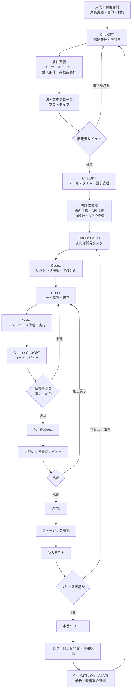
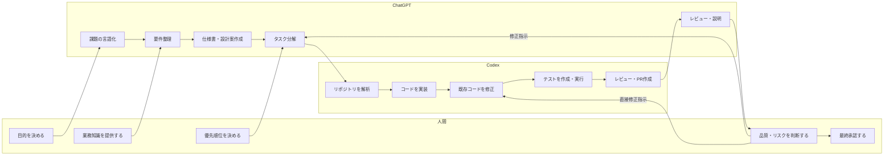
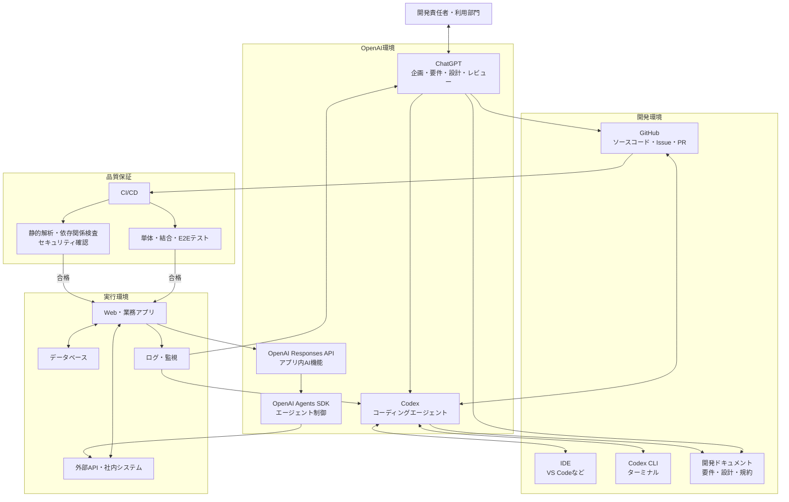
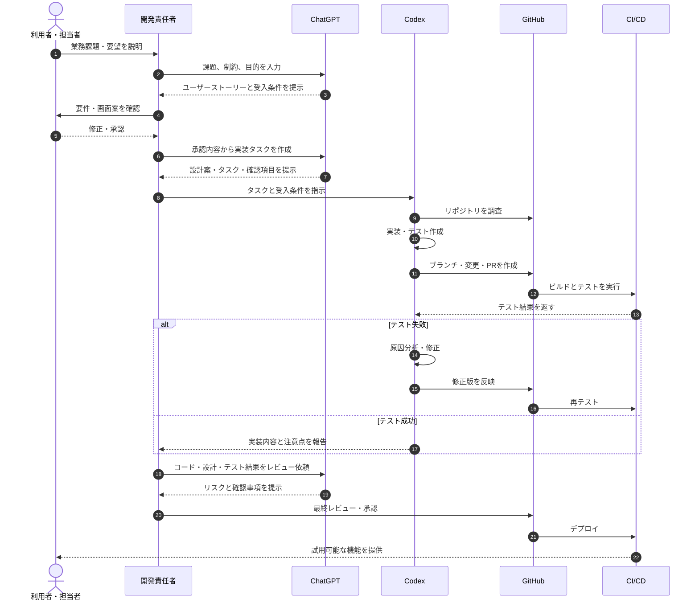
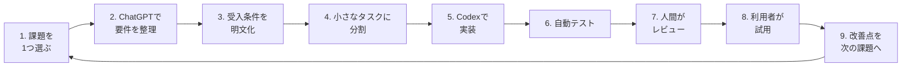

# OpenAIベースのAI駆動開発

## 1. AI駆動開発とは

AI駆動開発（AI-Driven Development）は、AIを単なるコード生成ツールとして使うのではなく、企画、要件定義、設計、実装、テスト、レビュー、運用改善まで、ソフトウェア開発プロセス全体に組み込む開発手法です。

従来の開発では、人間が各工程を順番に進めることが中心でした。

```text
要件定義
   ↓
設計
   ↓
実装
   ↓
テスト
   ↓
運用保守
```

AI駆動開発では、人間とAIが各工程を行き来しながら短いサイクルを繰り返します。

```text
課題
  ↓↑
要件
  ↓↑
UI
  ↓↑
設計
  ↓↑
実装
  ↓↑
テスト
```

人間の役割は、単にコードを書くことから、何を作るかを決め、AIへ適切な指示を与え、結果を評価することへと比重が移ります。

---

## 2. ChatGPTとCodexによるAI駆動開発

ChatGPTとCodexを組み合わせることで、OpenAIベースのAI駆動開発が可能です。

役割は次のように整理できます。

| 担当 | 主な役割 |
|---|---|
| 人間 | 目的、優先順位、業務判断、リスク判断、最終承認 |
| ChatGPT | 壁打ち、課題整理、要件定義、設計、文書化、タスク分解 |
| Codex | リポジトリ調査、コード実装、修正、テスト、レビュー、PR作成 |
| CI/CD | 自動ビルド、自動テスト、静的解析、デプロイ |
| 利用者 | UI・業務適合性の確認、フィードバック |

考え方としては、次のようになります。

- ChatGPT：企画者、設計者、PM、レビュー支援
- Codex：実装担当のソフトウェアエンジニア
- 人間：目的設定、判断、承認、責任
- CI/CD：自動検証とリリース

---

## 3. OpenAIベースのAI駆動開発プロセス全体



中心となる流れは次のとおりです。

```text
課題整理
  ↓
要件・設計
  ↓
Codexによる実装
  ↓
自動テスト
  ↓
人間による確認
  ↓
利用者からのフィードバック
  ↓
次の改善
```

---

## 4. 人間・ChatGPT・Codexの役割分担



### 人間の役割

- 本質的な課題を発見する
- 目的と優先順位を決める
- 利害関係者と合意形成する
- 品質基準を設定する
- セキュリティや法務上のリスクを判断する
- 最終的な承認と責任を持つ

### ChatGPTの役割

- 業務課題の整理
- ヒアリング内容の構造化
- ユーザーストーリー作成
- 受入条件の明文化
- 画面、API、DB、クラス設計の支援
- 開発タスクへの分解
- コードや設計のレビュー
- READMEや仕様書などの文書化

### Codexの役割

- リポジトリ構造の調査
- 既存コードの理解
- 新機能の実装
- バグ修正
- リファクタリング
- 単体テスト、結合テストの作成
- テスト実行と失敗原因の分析
- コードレビュー
- Pull Request作成

---

## 5. 開発環境を含めた構成図



### CodexとOpenAI APIの違い

- **Codex**  
  ソフトウェアを作るための開発エージェントです。リポジトリを理解し、コードの実装、修正、テスト、レビューなどを行います。

- **Responses API**  
  完成したアプリケーションへAI機能を組み込むためのAPIです。文章生成、分析、検索、ツール利用などをアプリから呼び出します。

- **Agents SDK**  
  複数のツールやエージェント、セッション、ガードレールなどを管理し、AIエージェント型アプリケーションを構築するための仕組みです。

---

## 6. 1機能を開発する短い反復サイクル



---

## 7. 推奨する実務プロセス



実務では、機能を小さく分割し、短い単位で実装と確認を繰り返します。

---

## 8. Codexへの依頼方法

AI駆動開発の基本単位は、単なるプロンプトではなく、**検証可能な開発タスク**です。

### 悪い依頼例

```text
在庫管理システムを完成させてください。
```

この依頼では、対象範囲、完成条件、品質基準が不明確です。

### 改善した依頼例

```text
商品一覧画面に商品名検索を追加してください。

受入条件：
・商品名の部分一致で検索できる
・未入力時は全件表示する
・検索結果が0件の場合はメッセージを表示する
・既存のページングを壊さない
・単体テストを追加する
・実装後に変更ファイルとテスト結果を報告する
```

Codexへの依頼には、次の項目を含めると効果的です。

1. 目的
2. 対象機能
3. 変更してよい範囲
4. 受入条件
5. 変更してはいけない箇所
6. 必要なテスト
7. 完了時の報告内容

---

## 9. OpenAIベースのAI駆動開発の基本原則

### 1. AIへ丸投げしない

AIは実装速度を高めますが、目的や業務上の正しさを自動的に保証するものではありません。

### 2. 受入条件を先に決める

何をもって完成とするかを明文化してからCodexへ依頼します。

### 3. 小さな単位で進める

大規模な機能を一括依頼せず、短時間で確認できる単位へ分割します。

### 4. 自動テストを重視する

AIが生成したコードも、必ずテストで検証します。

### 5. 人間が最終判断する

業務適合性、セキュリティ、法務、品質、保守性については、人間が責任を持って確認します。

### 6. ドキュメントをAIと共有する

要件、設計、コーディング規約、禁止事項、テスト方針をリポジトリ内に配置すると、Codexが一貫した実装を行いやすくなります。

---

## 10. まとめ

OpenAIベースのAI駆動開発では、次の役割分担が基本になります。

```text
人間
  ↓ 目的・判断・承認
ChatGPT
  ↓ 課題整理・要件・設計・タスク分解
Codex
  ↓ 実装・テスト・修正・PR
CI/CD
  ↓ 自動検証・デプロイ
利用者
  ↓ フィードバック
次の改善
```

重要なのは、Codexへ開発を丸投げすることではありません。

人間が目的と合格条件を決め、ChatGPTが要件と設計を整理し、Codexが実装し、自動テストと人間のレビューで品質を確認することで、実践的なAI駆動開発が成立します。
